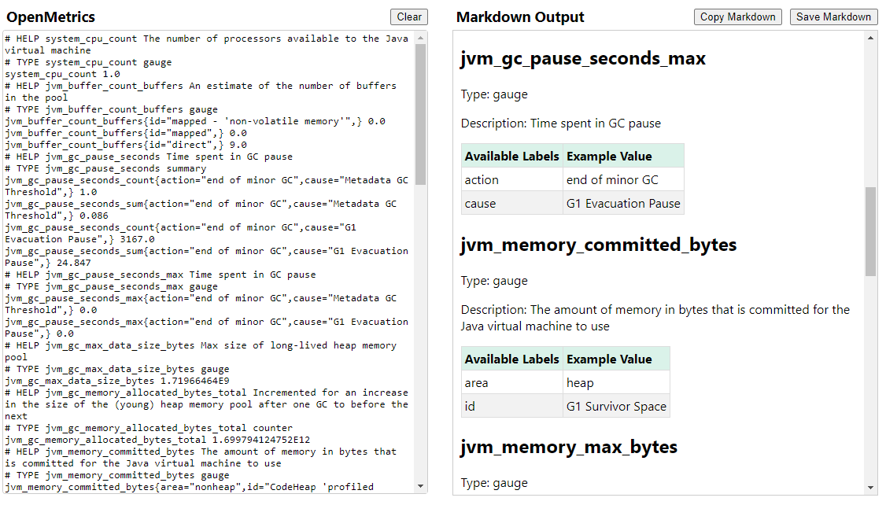

# OpenMetrics to Markdown

Looking for a way to document your [OpenMetrics](https://openmetrics.io/)? Me too! OpenMetrics-to-Markdown is a _React_ application that converts an _OpenMetrics_ file to a Markdown file. Just paste the plaintext of an _OpenMetrics_ or [Prometheus](https://prometheus.io/) output into the text area. The application will convert the _OpenMetrics_ file to Markdown and display the results in the text area.

## Online Demo

You can try OpenMetrics-to-Markdown without installing it on your machine. Try the [Online Demo](https://jburgess.github.io/openmetrics-to-markdown/).

## Screenshot

## Contributing

If you would like to contribute to the development of OpenMetrics-to-Markdown, please fork the repository and submit a pull request. We would love to hear your ideas for new features, improvements or bug fixes.

## License

This project is licensed under the MIT License. Please refer to the [LICENSE](LICENSE) file for more information.
